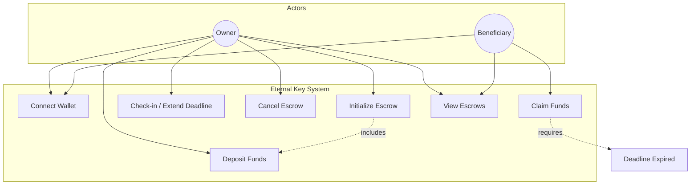

# Eternal Key 🔑

A decentralized "dead man's switch" for crypto inheritance on Solana, ensuring your digital assets reach your loved ones. Or just use it as a simple time-lock for your solana based asset to surprise someone on their birthday maybe.

## 🌟 The Problem

What if Satoshi Nakamoto wanted to pass on his 1.1 million BTC but disappeared or passed away? In the crypto world, there's no built-in inheritance system. Unlike traditional banking, crypto assets can be permanently lost if the owner passes away without sharing their private keys or recovery phrases. I wished to make something that would allow people to easily set up an inheritance system for their crypto assets, without the need of a centralized service.

## 💡 The Solution

Eternal Key provides an automated, trustless solution for crypto inheritance:

- Set up a "dead man's switch" that activates after a period of inactivity
- Designate beneficiaries who can claim assets after the deadline
- Regular "check-ins" to prove you're still active
- Completely decentralized and non-custodial
- Built on Solana for speed and low costs
- The SOL locked into the escrow can be recovered once the account is closed upon withdrawal from the beneficiary.

## 🚀 Features

- **Activity Monitoring**: Automated tracking of wallet activity
- **Secure Transfers**: Trustless transfer to beneficiaries after inactivity threshold
- **Flexible Check-ins**: Extend your deadline with simple check-in transactions
- **Multi-Asset Support**: Works with SOL and other Solana tokens
- **Non-custodial**: You maintain full control of your assets
- **Low Cost**: Minimal fees for setup and maintenance

## 💻 Smart Contract

The core functionality is implemented in Rust using the Anchor framework:

- `initialize`: Create new dead man's switch
- `deposit`: Add funds to escrow
- `checkin`: Reset/extend the deadline
- `claim`: Beneficiary claims funds after deadline
- `cancel`: Owner cancels switch and reclaims funds

## System Architecture

### Use Case Diagram



### Sequence Diagram - Create Escrow Flow

```mermaid
sequenceDiagram
    autonumber
    actor Owner
    participant Frontend as Frontend (React)
    participant Wallet as Solana Wallet
    participant Program as Smart Contract
    participant Blockchain as Solana Blockchain

    Owner->>Frontend: Enter beneficiary address, amount & deadline
    Frontend->>Frontend: Validate inputs
    Frontend->>Wallet: Request wallet connection
    Wallet-->>Frontend: Return public key

    rect rgb(40, 40, 60)
        Note over Frontend,Blockchain: Initialize Escrow Transaction
        Frontend->>Program: Call initialize(deadline, beneficiary, seed)
        Program->>Program: Validate deadline > current_time
        Program->>Blockchain: Create Escrow PDA Account
        Blockchain-->>Program: Escrow account created
        Program-->>Frontend: Transaction confirmed
    end

    rect rgb(40, 60, 40)
        Note over Frontend,Blockchain: Deposit Funds Transaction
        Frontend->>Wallet: Request transaction approval
        Wallet-->>Owner: Show transaction details
        Owner->>Wallet: Approve transaction
        Wallet->>Program: Call deposit(amount)
        Program->>Program: Validate amount > 0
        Program->>Blockchain: Transfer SOL to Escrow PDA
        Blockchain-->>Program: Transfer successful
        Program-->>Frontend: Deposit confirmed
    end

    Frontend-->>Owner: Show success notification
```



### Sequence Diagram - Check-in Flow

```mermaid
sequenceDiagram
    autonumber
    actor Owner
    participant Frontend as Frontend (React)
    participant Wallet as Solana Wallet
    participant Program as Smart Contract
    participant Blockchain as Solana Blockchain

    Owner->>Frontend: Enter extension duration (days/months/years)
    Frontend->>Frontend: Calculate new deadline
    Frontend->>Wallet: Request transaction approval
    Wallet-->>Owner: Show transaction details
    Owner->>Wallet: Approve transaction

    rect rgb(40, 40, 60)
        Note over Frontend,Blockchain: Check-in Transaction
        Wallet->>Program: Call checkin(new_deadline)
        Program->>Program: Validate current_time < deadline
        Program->>Program: Validate new_deadline > current_time
        Program->>Blockchain: Update escrow deadline & last_checkin
        Blockchain-->>Program: Update successful
        Program-->>Frontend: Check-in confirmed
    end

    Frontend-->>Owner: Show success & updated deadline
```



### Sequence Diagram - Claim Funds Flow (Beneficiary)

```mermaid
sequenceDiagram
    autonumber
    actor Beneficiary
    participant Frontend as Frontend (React)
    participant Wallet as Solana Wallet
    participant Program as Smart Contract
    participant Blockchain as Solana Blockchain

    Beneficiary->>Frontend: View available escrows
    Frontend->>Blockchain: Fetch escrows where user is beneficiary
    Blockchain-->>Frontend: Return escrow list

    Beneficiary->>Frontend: Click "Claim" on expired escrow
    Frontend->>Frontend: Verify deadline has passed

    alt Deadline Not Reached
        Frontend-->>Beneficiary: Show error "Cannot claim yet"
    else Deadline Expired
        Frontend->>Wallet: Request transaction approval
        Wallet-->>Beneficiary: Show transaction details
        Beneficiary->>Wallet: Approve transaction

        rect rgb(60, 40, 40)
            Note over Frontend,Blockchain: Claim Transaction
            Wallet->>Program: Call claim()
            Program->>Program: Validate current_time >= deadline
            Program->>Blockchain: Transfer all SOL to beneficiary
            Program->>Blockchain: Close escrow account
            Blockchain-->>Program: Claim successful
            Program-->>Frontend: Claim confirmed
        end

        Frontend-->>Beneficiary: Show success notification
    end
```



### Sequence Diagram - Cancel Escrow Flow

```mermaid
sequenceDiagram
    autonumber
    actor Owner
    participant Frontend as Frontend (React)
    participant Wallet as Solana Wallet
    participant Program as Smart Contract
    participant Blockchain as Solana Blockchain

    Owner->>Frontend: Click "Cancel" on escrow
    Frontend->>Wallet: Request transaction approval
    Wallet-->>Owner: Show transaction details
    Owner->>Wallet: Approve transaction

    rect rgb(60, 50, 40)
        Note over Frontend,Blockchain: Cancel Transaction
        Wallet->>Program: Call cancel()
        Program->>Program: Validate owner is signer
        Program->>Blockchain: Transfer all SOL back to owner
        Program->>Blockchain: Close escrow account
        Blockchain-->>Program: Cancel successful
        Program-->>Frontend: Cancel confirmed
    end

    Frontend-->>Owner: Show success & funds returned
```



### Overall System Flow

```mermaid
flowchart TD
    subgraph Setup["Setup Phase"]
        A[Owner Connects Wallet] --> B[Enter Beneficiary Address]
        B --> C[Set Deadline Date]
        C --> D[Set Deposit Amount]
        D --> E[Initialize Escrow]
        E --> F[Deposit SOL to Escrow PDA]
    end

    subgraph Active["Active Phase"]
        F --> G{Owner Active?}
        G -->|Yes| H[Owner Check-in]
        H --> I[Extend Deadline]
        I --> G
        G -->|No Activity| J[Deadline Expires]
    end

    subgraph Resolution["Resolution Phase"]
        J --> K[Beneficiary Claims Funds]
        K --> L[Escrow Closed]
        
        G -->|Owner Decides| M[Cancel Escrow]
        M --> N[Funds Returned to Owner]
        N --> O[Escrow Closed]
    end

    style Setup fill:#1a1a2e,stroke:#16213e
    style Active fill:#0f3460,stroke:#16213e
    style Resolution fill:#533483,stroke:#16213e
```



## 🛠️ Developer Setup

### Prerequisites

- [Rust](https://rustup.rs/) (latest stable)
- [Solana CLI](https://docs.solana.com/cli/install-solana-cli-tools) (v1.18+)
- [Anchor CLI](https://www.anchor-lang.com/docs/installation) (v0.32.1)
- [Bun](https://bun.sh/) (v1.0+)

### Step-by-Step Installation

#### 1. Install Rust

```bash
# Install Rust via rustup
curl --proto '=https' --tlsv1.2 -sSf https://sh.rustup.rs | sh

# Restart terminal or run:
source $HOME/.cargo/env

# Verify installation
rustc --version
```

#### 2. Install Solana CLI

```bash
# macOS / Linux
sh -c "$(curl -sSfL https://release.anza.xyz/stable/install)"

# Add to PATH (add this to your ~/.zshrc or ~/.bashrc)
export PATH="$HOME/.local/share/solana/install/active_release/bin:$PATH"

# Verify installation
solana --version
```

#### 3. Install Anchor CLI

```bash
# Install AVM (Anchor Version Manager)
cargo install --git https://github.com/coral-xyz/anchor avm --force

# Install and use Anchor 0.32.1
avm install 0.32.1
avm use 0.32.1

# Verify installation
anchor --version
```

#### 4. Install Bun

```bash
# macOS / Linux
curl -fsSL https://bun.sh/install | bash

# Verify installation
bun --version
```

### Quick Start

```bash
# Clone the repository
git clone https://github.com/your-username/eternal-key.git
cd eternal-key

# Full setup (install deps + generate keys + build)
make setup

# Run tests
make test
```

### Manual Setup (without Make)

If you prefer not to use Make:

```bash
# 1. Install JS dependencies
cd asset-tokenization
bun install

# 2. Generate Solana keypair (if you don't have one)
solana-keygen new --no-bip39-passphrase

# 3. Configure Solana for local development
solana config set --url localhost

# 4. Build the program
anchor build

# 5. Run tests (starts local validator automatically)
anchor test
```

### Available Commands

| Command | Description |
|---------|-------------|
| `make setup` | Full setup (install deps + generate keys + build) |
| `make install` | Install all dependencies |
| `make build` | Build the Solana program |
| `make test` | Run all tests (starts local validator) |
| `make clean` | Remove build artifacts |
| `make validator` | Start local Solana validator |
| `make deploy-devnet` | Deploy to Solana devnet |
| `make versions` | Check installed tool versions |

### Troubleshooting

**Build fails with "edition2024" error:**
```bash
# This is a known issue with newer crate versions. The project includes
# a Cargo.lock that pins compatible versions. Make sure you're using it.
cd asset-tokenization && anchor build
```

**Tests fail with "Connection refused":**
```bash
# The local validator isn't running. Use `anchor test` which starts it,
# or start it manually:
solana-test-validator --reset
```

**"Unable to read keypair file":**
```bash
# Generate a new keypair:
solana-keygen new --no-bip39-passphrase -o ~/.config/solana/id.json
```

### Project Structure

```
eternal-key/
├── app/                    # Next.js frontend
├── asset-tokenization/     # Solana program (Anchor)
│   ├── programs/           # Rust smart contracts
│   ├── tests/              # Integration tests
│   └── Anchor.toml         # Anchor configuration
├── components/             # React components
├── Makefile               # Development commands
└── README.md
```

<p align="center">Built with ❤️ for the Solana community</p>
