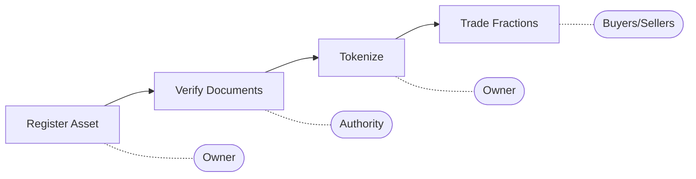

# Asset Tokenization Platform

A Solana program for tokenizing real-world assets like real estate, gold, infrastructure, and more. Enables fractional ownership and instant transfers of traditionally illiquid assets.

## The Problem

India's wealth is locked in traditionally illiquid assets:
- **Real Estate**: ₹200+ trillion market, transactions take months
- **Gold**: ₹40+ trillion, physical storage challenges
- **Infrastructure**: Limited retail access to large projects

While UPI enables instant ₹1 transfers, buying a ₹1 share of a building is impossible. These assets "still move like it's 1995."

## The Solution

Asset Tokenization enables:
- **Fractional Ownership**: Divide any asset into tradeable tokens
- **Instant Settlement**: Buy/sell fractions in seconds on Solana
- **Document Verification**: On-chain proof of legal documents
- **Transparent Pricing**: Real-time valuation and trading
- **Low Barriers**: Anyone can own a piece of premium assets

## Supported Asset Types

| Type | Examples |
|------|----------|
| Real Estate | Land, buildings, apartments |
| Gold | Bars, coins, jewelry |
| Infrastructure | Roads, bridges, power plants |
| Vehicles | Cars, trucks, machinery |
| Art | Paintings, sculptures |
| Commodities | Agricultural, industrial |

## Smart Contract Instructions

| Instruction | Description |
|-------------|-------------|
| `initialize_platform` | Set up platform config and fees |
| `register_asset` | Register a new real-world asset |
| `verify_asset` | Verify asset documents (admin) |
| `tokenize_asset` | Mint fractional tokens for asset |
| `buy_fractions` | Purchase fractions of an asset |
| `sell_fractions` | Sell owned fractions |
| `add_document` | Attach legal documents to asset |
| `update_asset` | Update asset metadata/valuation |
| `transfer_ownership` | Transfer fractions between users |

## Asset Lifecycle



## Quick Start

```bash
# Clone the repository
git clone https://github.com/your-username/eternal-key.git
cd eternal-key

# Full setup
make setup

# Run tests
make test
```

See [docs/SETUP.md](docs/SETUP.md) for detailed installation instructions.

## Project Structure

```
eternal-key/
├── asset-tokenization/     # Solana program (Anchor)
│   ├── programs/           # Rust smart contracts
│   ├── tests/              # Integration tests
│   └── Anchor.toml         # Configuration
├── app/                    # Next.js frontend
├── components/             # React components
├── docs/                   # Documentation
│   ├── SETUP.md           # Developer setup guide
│   └── PLAN.md            # Frontend development plan
└── Makefile               # Development commands
```

## Available Commands

| Command | Description |
|---------|-------------|
| `make setup` | Install deps + generate keys + build |
| `make build` | Build the Solana program |
| `make test` | Run all tests |
| `make deploy-devnet` | Deploy to Solana devnet |

## Technical Details

**Program ID**: `EjLLVvxkMtssALhHv4dvKhkxYJQKGmMUcB38DboGMYtJ`

**Key Accounts**:
- `PlatformConfig` - Global platform settings and fees
- `Asset` - Individual asset with metadata and status
- `Ownership` - User's fractional ownership of an asset
- `Document` - Legal documents attached to assets

**Dependencies**:
- Anchor 0.32.1
- Solana 1.18+
- SPL Token Program
- Metaplex Token Metadata

## Documentation

- [Setup Guide](docs/SETUP.md) - Development environment setup
- [Frontend Plan](docs/PLAN.md) - UI implementation roadmap

## License

MIT

---

<p align="center">Built with ❤️ for the Solana community</p>
